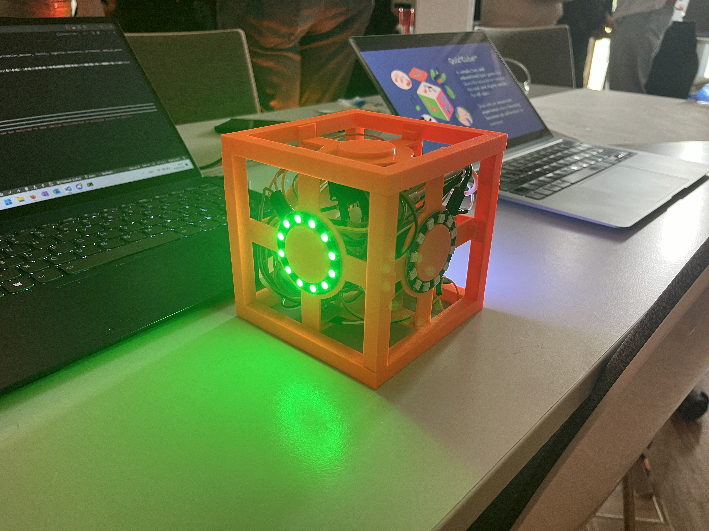

# QuizCube

## Extensions

- [Board](https://github.com/Clickau/BoardGame)

## Inspiration

When it comes to games, catering to a wide age range can be challenging. How can we create games that engage both toddlers and seniors, keeping them motivated for the long haul?

## What it does

The QuizCube makes this possible by combining simple interaction principles with child-friendly quiz content. Thanks to its digital flexibility, the complexity and variety of content can also meet the demands of serious gaming while catering to the needs of the elderly. As a result, players of all ages can benefit by being connected and can extend their knowledge.

## How we built it

Game Design: In an iterative game design process, we challenged the initial idea, opened up the problem and solution spaces, and were able to quickly narrow down to a feasible MVP solution.

Hardware:

- Cube: 3D-printed Cube 6 LED rings (WS2812B) for each Cube side, speaker, gyroscope sensor, battery, ESP-32 WROOM-32, SD card reader
- Playboard: WS2811 LED strip, ESP-32 WROOM-32

Software:

- Using Arduino framework in Platform-IO
- Game Logic for detecting user manipulations on the Cube via accelerometer sensor data

## Challenges we ran into

Conceptual complexity of game design. 3D printing time as a serious bottleneck. Interplay of hardware and software.

## Accomplishments that we're proud of

Great teamwork round-the-clock with everybody bringing their individual core expertise to the project. The Cube itself as a playful physical artifact. Development and specification of a clear and inspiring product vision with concrete companion products/games (CubeBoard, CubeFruits, CubeRace).

## What we learned

Time is never enough. Game design is very hard but very fun :smile: You have to narrow down pretty quickly to gain focus as soon as possible to start implementation in time.

## What's next for QuizCube

Single player Mode with AI play partner. Remote Play. Personalization. Adaptive Difficulty Levels. Endless User Scenarios (Medical, Therapeutical, Academic, ...). AI-generated individual quiz contents. Companion website/ mobile app. Accessibility mode. Parent Observation. Online Community. ... just to name a few potentials :smile:

## Built With

- arduino
- c++
- http-api
- platform-io

## Slides

[Canva](https://www.canva.com/design/DAGGL-63odI/mzV7O-PFeGLx1_fE3UncIQ/view?utm_content=DAGGL-63odI&utm_campaign=designshare&utm_medium=link&utm_source=editor#1)
